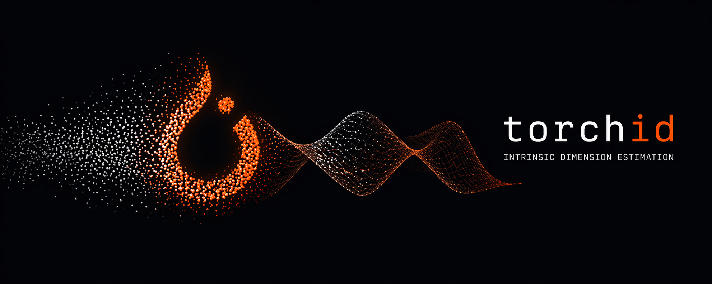

<p align="center">
  
</p>

GPU-accelerated intrinsic dimension estimators in PyTorch. A port of
[scikit-dimension](https://github.com/scikit-learn-contrib/scikit-dimension) with
batched/vectorized implementations and CUDA support.

## Why

`scikit-dimension` is the reference library for intrinsic dimension (ID) estimation but
is CPU-only and relies heavily on per-point Python loops. `torchid` re-implements every
estimator using batched `torch` ops so the same methods run 100–2700× faster on GPU
(measured on an NVIDIA H100, see [BENCHMARKS.md](BENCHMARKS.md)) while producing outputs
that match the reference library within documented tolerances.

## Install

```bash
pip install "torchid[cpu]"   # CPU-only (faiss-cpu)
pip install "torchid[cuda]"  # GPU-enabled (faiss-cuda-cu128, manylinux_2_28+)
```

For a CUDA-capable install, also pick the PyTorch wheel that matches your driver, e.g.:

```bash
pip install torch --index-url https://download.pytorch.org/whl/cu128
pip install "torchid[cuda]"
```

For running parity tests against `scikit-dimension` from a clone:

```bash
uv sync --extra cpu --group validation
```

## Usage

```python
import torch
from torchid.estimators import lPCA

X = torch.randn(10_000, 50, device="cuda")
est = lPCA().fit(X)
print(est.dimension_)
```

## Differentiable ID as a loss

The estimator classes are fit-only; `torchid.functional` provides differentiable
functional forms (`mle_id`, `twonn_id`, `mom_id`, `mada_id`, `pr_id`) and
`torchid.losses` wraps them into a minimizable objective — maximizing ID becomes
minimizing the ratio `1 - id/D`:

```python
from torchid import IntrinsicDimensionLoss

id_loss = IntrinsicDimensionLoss(method="twonn", mode="maximize")

feats = encoder(batch)                    # (B, D), requires_grad
loss = task_loss + 0.1 * id_loss(feats)  # regularize toward higher ID
loss.backward()
```

Neighbor selection comes from a no-grad kNN; distances are recomputed
differentiably from the gathered coordinates, so gradients are exact away from
neighbor-order ties. See the [API reference](docs/api.md) for details.
