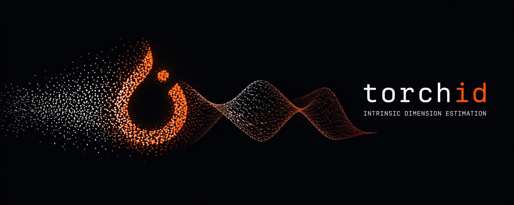

{ .off-glb }

**GPU-accelerated intrinsic dimension estimators in PyTorch.**

A drop-in, batched port of [scikit-dimension](https://github.com/scikit-learn-contrib/scikit-dimension) — same 12 estimators, same APIs, same numerical outputs, but running end-to-end on CUDA tensors and avoiding the per-point Python loops that dominate skdim's wall time.

## Install

```bash
pip install torchid
```

## Quick example

```python
import torch
from torchid.estimators import lPCA, TwoNN, MLE

X = torch.randn(10_000, 50, device="cuda")

print(lPCA().fit(X).dimension_)
print(TwoNN().fit(X).dimension_)
print(MLE().fit(X).dimension_)
```

## What it does

Estimates the **intrinsic dimension** of a dataset — the number of degrees of freedom actually spanned by the data, as opposed to the ambient embedding dimension. Useful for model diagnostics, manifold learning, feature engineering, anomaly detection, and deciding how much a representation has "collapsed."

Twelve classical estimators are ported one-for-one from scikit-dimension:

- **Global:** `lPCA`, `TwoNN`, `MLE`, `CorrInt`, `MiND_ML`, `KNN`, `DANCo`, `FisherS`
- **Local:** `MOM`, `MADA`, `TLE`, `ESS`

Each one lives in `torchid.estimators` and exposes the same `fit(X).dimension_` / `fit(X).dimension_pw_` pattern sklearn users expect.

## Highlights

- **Streaming** — drop `IntrinsicDimension` into any torchmetrics-based training loop and log per-epoch ID without writing a buffer.
- **Fast on CUDA** — on an H100, up to **2725×** faster than skdim for MADA, **361×** for TwoNN, **234×** for CorrInt at n=20k; ESS is **9000×+** at the smallest size where skdim still runs. See [Performance](performance.md) for the full matrix.
- **Faster on CPU too** — the `knn` primitive dispatches to `faiss-cpu` on CPU tensors and to pure torch on CUDA; no sklearn dependency at runtime.
- **Batched, not parallelized** — every estimator is rewritten as a single tensor operation over all neighborhoods (`(N, k, k)` tensors, batched SVDs, closed-form MLE). No `joblib.Parallel`, no per-point Python loops.
- **Parity-tested** — every estimator is asserted to match scikit-dimension within a documented per-estimator tolerance band on hyperballs, affine subspaces, and the swiss roll. See [Parity](parity.md).
- **Python 3.13-ready** — skdim's `MLE.__init__` is broken on 3.13 (mutates `frame.f_locals`); torchid is clean.

## Benchmarks (H100 vs skdim CPU)

| estimator | size                             | cuda speedup |
| --------- | -------------------------------- | -----------: |
| MADA      | n=20k, D=50                      |    **2725×** |
| TwoNN     | n=20k, D=50                      |     **361×** |
| CorrInt   | n=2k, D=20                       |     **234×** |
| FisherS   | n=10k, D=20                      |     **168×** |
| KNN       | n=10k, D=20                      |     **126×** |
| TLE       | n=2k, D=20                       |     **113×** |
| ESS       | n=500 (skdim infeasible at n≥2k) |   **9000×+** |

Also benchmarked on A100 80 GB (≈ 1.4-1.5× the 3090) and RTX 3090 (24 GB) baseline. Full table in [Performance](performance.md).

## Acknowledgments

Built by [Isaac Corley](https://github.com/isaaccorley) on top of the excellent scikit-dimension reference implementation by Jonathan Bac et al. Developed with [Claude](https://claude.ai) as an AI pair-programmer.

## License

Apache-2.0
